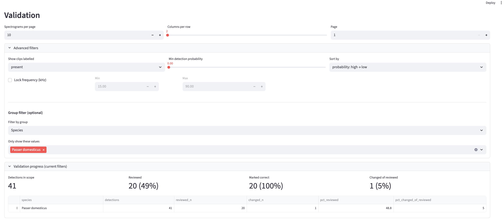
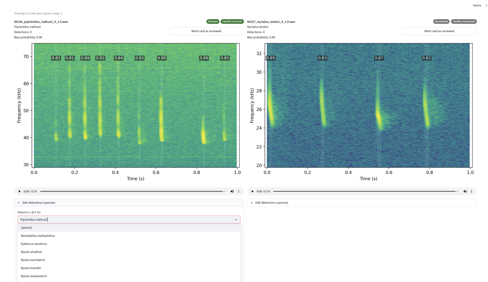

```{=html}
<section class="page-hero research-hero">
  <div class="page-hero-shade"></div>
  <div class="site-frame page-hero-content">
    <p class="eyebrow light">Research</p>
    <h1>Understanding ecological change across scales.</h1>
    <p>
      My work combines macroecology, functional traits, machine learning, bioacoustics and scientific
      software to understand forests, biodiversity and animal populations.
    </p>
  </div>
</section>

<div class="site-frame page-content">
  <section class="page-intro-wide">
    <p class="eyebrow">Research programme</p>
    <h2>From continental forest change to individual animal vocalisations.</h2>
    <p>
      The projects differ in scale, but share a common purpose: extracting biologically meaningful
      evidence from complex environmental data and translating it into models, workflows and tools
      that can support research and conservation practice.
    </p>
  </section>

  <section id="future-forests" class="research-feature research-feature-large">
    <div class="research-photo forest-research-photo" role="img"
         aria-label="Dense North American forest landscape"></div>

    <div class="research-copy">
      <p class="project-meta">Macroecology · Climate change · Community composition</p>
      <h2>Future forest communities</h2>

      <p>
        My doctoral research asks which existing North American forest communities are likely to remain
        suited to late-century climatic conditions, where no-analogue communities may emerge, and what
        those communities could consist of.
      </p>

      <p>
        I combine large-scale forest inventory data with climate projections, species composition,
        functional traits and machine-learning models. The work predicts future species assemblages,
        assigns them to existing forest-community types and quantifies where projected communities fall
        outside present-day ecological space.
      </p>

      <p>
        The analysis also examines feasibility: how far species may need to disperse, whether suitable
        seed zones exist, and how uncertainty in climate and trait projections affects the conclusions.
      </p>

      <div class="research-links">
        <a href="https://forest-viewer.streamlit.app/" class="text-link">Launch forest viewer →</a>
        <a href="https://github.com/AlastairPickering/" class="text-link">View code →</a>
      </div>
    </div>
  </section>

  <section class="research-split">
    <article class="research-card">
      <div class="research-card-image traits-image" role="img"
           aria-label="Forest canopy and environmental gradients"></div>

      <div class="research-card-copy">
        <p class="project-meta">Functional ecology</p>
        <h3>Trait–environment compatibility</h3>

        <p>
          This work tests whether the functional composition of existing forest communities remains
          compatible with future environmental conditions.
        </p>

        <p>
          Using community-weighted means across physiological, tolerance and symbiotic traits, I model
          current trait–environment relationships and project how far future communities may move beyond
          the combinations observed today.
        </p>

        <p>
          The aim is to make future ecological communities biologically interpretable: not only where
          change may occur, but which ecological strategies and trait combinations those futures may require.
        </p>
      </div>
    </article>

    <article class="research-card">
      <div class="research-card-image ecosystem-image" role="img"
           aria-label="Forest ecosystem viewed across a broad landscape"></div>

      <div class="research-card-copy">
        <p class="project-meta">Ecosystem functioning</p>
        <h3>Traits and ecosystem services</h3>

        <p>
          I model how climate, forest structure and functional composition jointly shape ecosystem
          properties including carbon storage, species richness, carbon and biomass fluxes, timber production and habitat provision.
        </p>

        <p>
          The research separates direct climatic exposure from effects mediated through community traits
          and forest structure, helping identify where changes in composition may amplify or offset
          broader environmental pressures and what management levers may be available.
        </p>

        <p>
          It also evaluates which existing ecosystem service hotspots are most at risk and where new value may arise to help guide planning decisions and economic assessments.
        </p>
      </div>
    </article>
  </section>

  <section id="pamalytics" class="research-feature research-feature-software">
    <div class="research-copy">
      <p class="project-meta">Passive acoustic monitoring · Scientific software</p>
      <h2>PAMalytics</h2>

      <p>
        PAMalytics is an open-source, classifier-agnostic platform for ingesting, reviewing, validating
        and analysing passive acoustic monitoring detections.
      </p>

      <p>
        Automated classifiers can process very large datasets, but their outputs still require structured
        validation. In practice, predictions are often separated from the underlying audio and reviewed
        through ad hoc workflows that make error rates, sampling decisions and subsequent analyses difficult
        to document.
      </p>

      <p>
        PAMalytics reconnects detections to their source audio, provides spectrogram and playback tools,
        supports targeted and stratified review, records validation decisions and exports clean analytical
        datasets. It is designed for researchers and conservation practitioners who need a robust workflow
        without building bespoke software.
      </p>

      <p>
        Current case studies include pileated gibbon monitoring in Cambodia and species-level bird
        validation before biodiversity metrics are derived.
      </p>

      <div class="research-links">
        <a href="https://pamalytics-demo.streamlit.app/" class="text-link">Launch demo →</a>
        <a href="https://alastairpickering.github.io/PAMalytics/" class="text-link">Documentation →</a>
        <a href="https://github.com/AlastairPickering/" class="text-link">GitHub →</a>
      </div>
    </div>

    <div class="pam-gallery pam-gallery-research">
      
      
    </div>
  </section>

  <section id="elephant-bioacoustics" class="research-feature">
    <div class="research-photo elephant-research-photo" role="img"
         aria-label="African elephant standing in woodland"></div>

    <div class="research-copy">
      <p class="project-meta">Transfer learning · Conservation bioacoustics</p>
      <h2>Forest elephant vocalisations</h2>

      <p>
        Forest elephants are difficult to observe directly, but their low-frequency vocalisations contain
        information about identity, age, sex and behavioural context.
      </p>

      <p>
        I developed a scalable transfer-learning workflow that uses representations from large pre-trained
        audio models to classify demographic and behavioural attributes from relatively small labelled
        datasets.
      </p>

      <p>
        The study compares multiple acoustic representations and classifiers, evaluates performance under
        limited data and demonstrates how general-purpose audio models can support biologically meaningful
        inference for rare and cryptic species.
      </p>

      <p>
        The resulting paper was published in <em>Remote Sensing in Ecology and Conservation</em>.
      </p>

      <div class="research-links">
        <a href="https://scholar.google.com/citations?user=9N1dOVcAAAAJ&hl=en"
           class="text-link">View publication →</a>
        <a href="https://github.com/AlastairPickering/" class="text-link">View code →</a>
      </div>
    </div>
  </section>

  <section class="research-split">
    <article class="research-card">
      <div class="research-card-image gibbon-image" role="img"
           aria-label="Gibbon moving through tropical forest canopy"></div>

      <div class="research-card-copy">
        <p class="project-meta">Operational conservation AI</p>
        <h3>Gibbon monitoring</h3>

        <p>
          In collaboration with Conservation International, I am developing workflows for reviewing
          classifier detections of pileated gibbons across large and uneven acoustic datasets.
        </p>

        <p>
          The work focuses on targeted validation, sampling across sites and confidence ranges, and
          reducing the manual handling required to move from automated detections to reportable evidence.
        </p>

        <p>
          This provides an applied test case for PAMalytics and for broader questions around how acoustic
          AI can be deployed reliably in conservation programmes.
        </p>
      </div>
    </article>

    <article class="research-card">
      <div class="research-card-image field-image" role="img"
           aria-label="Ecological field survey in a wooded landscape"></div>

      <div class="research-card-copy">
        <p class="project-meta">Field ecology</p>
        <h3>Ecological monitoring</h3>

        <p>
          My computational work is grounded in practical field experience across acoustic and visual
          biodiversity surveys.
        </p>

        <p>
          This includes bat transects and emergence surveys, butterfly monitoring, plant and tree
          identification, camera-trap review and annotation of bird, bat and elephant vocalisations.
        </p>

        <p>
          Working with consultancies and conservation organisations provides direct experience of the
          operational constraints surrounding data collection, validation, reporting and decision-making.
        </p>
      </div>
    </article>
  </section>

  <section id="publications" class="publication-band">
    <div>
      <p class="eyebrow light">Publications and outputs</p>
      <h2>Peer-reviewed research, software and current manuscripts.</h2>
    </div>

    <div class="publication-links">
      <a href="https://scholar.google.com/citations?user=9N1dOVcAAAAJ&hl=en"
         class="ap-button primary-light">Google Scholar</a>
      <a href="https://github.com/AlastairPickering/"
         class="ap-button ghost-light">GitHub</a>
    </div>
  </section>
</div>
```
